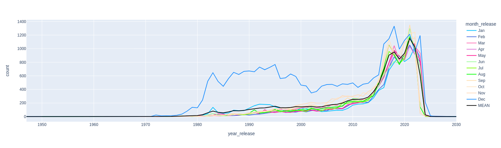
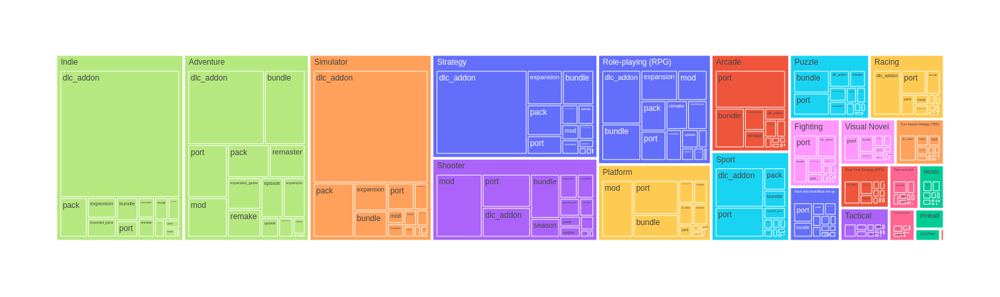

# Proyecto ETL Hackaboss
Hola, somos Dmitry Ryzhenkov, Samuel Pascual y Jacobo Brandariz Morano, estudiantes del bootcamp de Data Science de Hackaboss. Bienvenido a nuestro pequeño proyecto ETL de datos de videojuegos de IGDB de Twitch. <br><br>
Este trabajo muestra nuestras habilidades programando en Python así como el uso de algunas de sus librerías más relevantes en el mundo de los datos. Pueden también apreciar nuestro manejo de API's, comprensión de bases de datos relacionales, pipelines de ETL y, como bonus, nuestra habilid para la visualización de datos. Si desean, pueden ejecutar 'main.ipynb' desde Jupyter Notebooks y ver como funciona todo, además de interactuar con las visualizaciones (sí, son interactivas).<br><br>
En cualquier caso, pueden seguir bajando para ver un resumen del proceso y los resultados.

### Instrucciones
Desde la consola, clonan el repositorio.
```sh
git clone https://github.com/cuicuidev/project_etl_hackaboss.git

```
Una vez clonado, navegan a la carpeta.
```sh
cd project_etl_hackaboss
```
Desde ahí, crean un entorno nuevo de python.
```sh
python3 -m venv venv
```
Una vez creado el entorno, lo activan.
- Para los usuarios de Windows:
```sh
.\venv\Scripts\activate
```
- Para los usuarios de Linux o de MacOS:
```sh
source venv/bin/activate
```
Acto seguido, instalan todas las dependencias.
```sh
pip install -r dependencies.txt
```
Por último, deben crear un archivo api.json y rellenar los campos con sus claves API siguiendo este formato.
```json
{
    "IGDB" : {
        "clientID" : "",
        "clientSecret" : ""
    },

    "Airtable" : {
        "key" : "",
        "app" : "",
        "tbls" : ["","","","",""]
    }
}
```
donde deberán rellenar los campos con sus claves personales de las APIs.

### Extracción de datos
Se ha utilizado la API de IGDB de Twitch para conseguir datos acerca de los videojuegos.
De entre todos los endpoints que ofrece la API, se han descargado los datos de 'games', 'game_engines', 'language_supports', 'languages' y 'genres'.

### Transformación de datos
Los datos de IGDB están estructurados de manera relacional y cada enpoint proporciona acceso a una tabla de la base de datos. La tabla objetivo de este proyecto fue la de 'games'.
Primero se han borrado gran parte de las columnas de la tabla principal al ser irrelevantes. Las columnas con las que se ha trabajado son las siguientes:
- 'id'
- 'name'
- 'language_supports'
- 'game_engines'
- 'first_release_date'
- 'genres'
- 'category'

Acto seguido, se han convertido los id's de las columnas 'language_supports', 'game_engines', 'genres' y 'category' por los nombres de las tablas correspondientes.
Para la columna de 'language_supports', se han separado los datos por soportes de audio y de subtítulos en dos nuevas columnas.
La columna de 'first_release_date' se transformó de timestamp a objeto datetime y se separó en dos columnas, una para el año y otra para el mes.
Por último, se eliminaron las columnas con datos en crudo. La tabla transformada quedó así:
- 'id',
- 'name',
- 'game_engines',
- 'genres',
- 'category',
- 'audio_language_supports',
- 'subtitles_language_supports',
- 'month_release',
- 'year_release'

### Carga de datos
Los datos transformados se cargaron a tablas de airtable utilizando la API. Se tuvieron que crear cinco tablas separadas por el gran tamaño del dataset obtenido de la API de IGDB, ya que cada tabla soporta un máximo de 50k filas. Utilizando la API también se ha automatizado la descarga de datos.

### Visualizaciones
Con los datos transformados se han obtenido las siguientes visualizaciones que pueden arrojar algo de luz sobre la situación actual de la industria de los videojuegos, así como su historia.

##### Fechas de salida por mes del año a lo largo de los años
<br>
Es muy interesante ver como de manera consistente hay más salidas de juegos en diciembre, probablemente debido a que se acercan las navidades y se espera mayor venta.
Asimismo, también es curioso ver una bajada brusca en 2019. Es posible que la subida de precios de las tarjetas gráficas por la minería de criptomonedas tuvo algo que ver.
##### Top 10 Frameworks de desarrollo de videojuegos (general)
<br>
Aquí podemos ver a los dos gigantes en el mundo del game dev, Unity y Unreal Engine, dominando el top 10 con sus diferentes versiones. Al ser frameworks potentes a la vez que gratuitos, no es de extrañar que sean los más utilizados con diferencia.
##### Popularidad del Top 10 a lo largo de los años
<br>
En esta visualización podemos ver la evolución de la popularidad del top 10 a lo largo de los años, donde destaca la transcendencia sobre todo de Unity.
##### Popularidad de los lenguajes (audio y subtitulos)
<br>
No es de extrañar que el lenguaje más común sea el inglés. No obstante, esta visualización ofrece algo más que eso. Podemos ver como, bajando en popularidad, cada vez hay menos y menos soporte de audio en relación al soporte de subtítutlos, lo que nos indica que la falta de soporte de lenguajes no se debe solamente al desinterés de los desarrolladores, sino también a la falta de recursos.
##### Distribuciones de géneros y cateogrías de los videojuegos
<br>
Por último, podemos ver la distribución de los productos dentro de cada género. Se ha eliminado la categoría 'main_game' puesto que al ser la más común, no se podía apreciar la dominancia de las otras categorías.
